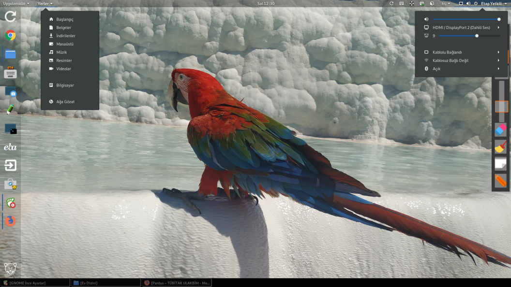
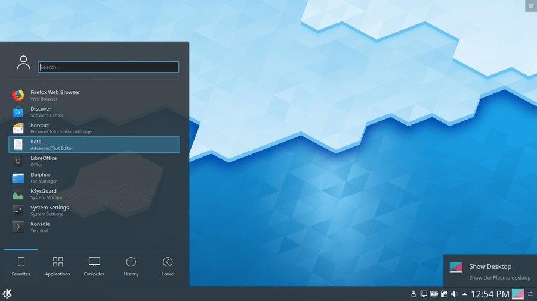
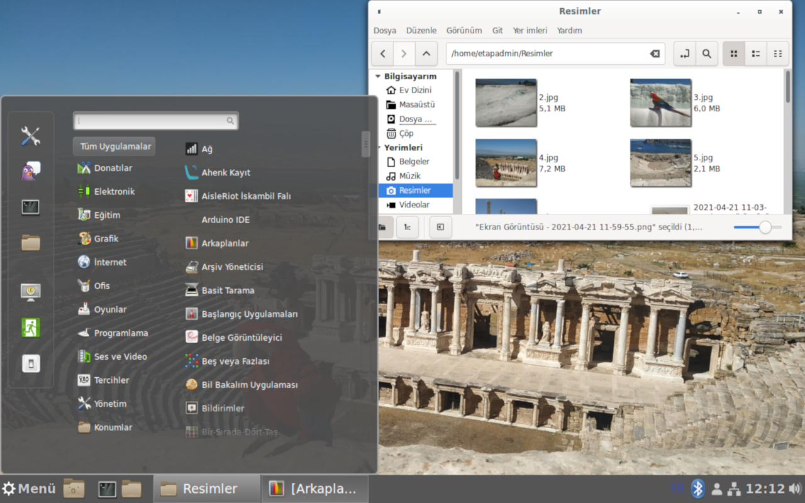
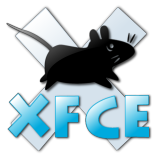
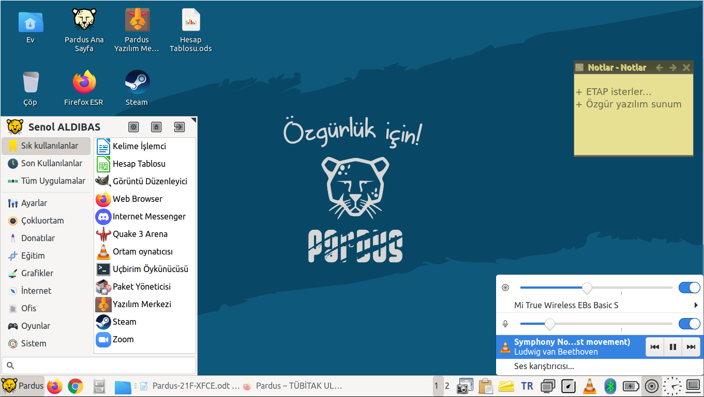

# GNU / Linux Masaüstü Ortamları

Bu eğitimin konusu olmasa da **GNU / Linux** masaüstü ortamlarından kısaca bahsedelim.

Masaüstü, sistemimizi kullanmak ve yönetmek için pencere, panel, simgeler ile görsel ağırlıklı kullanım sunan kabuktur. Bu grafik kabukları X Pencere katmanı üzerinde Pencere yöneticisi ve Masaüstü Ortamından oluşur.

Yaygın olarak kullanılan masaüstü ortamlarını, 

- [GNOME](https://www.gnome.org/)

- [KDE](https://kde.org/)

- [Xfce](https://xfce.org/)

- [LxQt](https://lxqt-project.org/)

- [Cinnamon](https://cinnamon-spices.linuxmint.com/)

- [Mate](https://mate-desktop.org/)

- [Unity](https://ubuntuunity.org/)

- [Pantheon](https://wiki.archlinux.org/title/Pantheon)
 
- [Enlightenment](https://www.enlightenment.org/)

- [Deepin](https://www.deepin.org/en/dde/)

şeklinde listeleyebiliriz.

 

## Gnome -GNU Network Object Model Environment-

**GNOME -GNU Ağ Nesne Modeli Ortamı-**, Açık kaynak kodlu özgür masaüstü ortamıdır. GNU Tasarısı'na bağlı GNOME Projesi topluluğunca geliştirilmekte olan GNOME, Unix ve BSD tabanlı birçok işletim sistemine kurulabilmektedir.

GNOME projesi, kullanıcılar için kolay ve etkileyici bir masaüstü ortamı ve  uygulama geliştirip masaüstünün kalanıyla birleştirmek için geliştirme platformu sunar. 

 

| **Tanım**   |  GNOME -GNU Network Object Model Environment- |
|-----|----|
| **Tür**  | Masaüstü ortamı |
| **İlk Yayınlanma** | 3 Mart 1999 |
| **Programlama dili** | C, XML, C++, C#, HTML, Vala, Python, JavaScript, CSS...|
| **Geliştirici(ler)** | GNOME geliştiricileri |
| **Lisans** | GPL – LGPL |
| **Resmi sitesi** | https://gnome.org |
| **Kod deposu** | https://gitlab.gnome.org/GNOME |
| **Wiki** | https://wiki.gnome.org |

 

## KDE -K Desktop Environment -

KDE, UNIX ve uyumlu sistemler için çağdaş masaüstü ortamı sağlamaktadır. GNU/Linux gibi özgür bir UNIX yürütücüsü ile UNIX/KDE tamamıyla özgür ve açık bilgisayar platformu sağlar. 

 
 
 

 

| **Tanım**   | KDE (K Desktop Environment - K Masaüstü Ortamı) |
|------|------|
| **Başlangıç** | 14 Ekim 1996 |
| **Tür**       | Masaüstü ortamı|
| **Geliştirici(ler)** | KDE Geliştirme Takımı|
| **Lisans**           | GPL ve diğerleri |
| **Resmi sitesi**     | kde.org |
| **Wiki**             | wiki.kde.org / community.kde.org |  

## Cinnamon

X Pencere Sistemi için ücretsiz ve açık kaynaklı bir masaüstü ortamıdır. Cinnamon, Linux Mint dağıtımının ana masaüstü ortamıdır ve diğer Linux dağıtımları ve diğer Unix benzeri işletim sistemleri için isteğe bağlı bir masaüstü olarak da mevcuttur.

 
 

 
 
 

| **Tanım** | Ücretsiz ve açık kaynaklı bir masaüstü ortamıdır. |
|-----------|-----------|
| **İlk Yayınlanma** | 2011 |
| **Tür** | Masaüstü ortamı | 
| **Programlama dili**  | C (GTK), JavaScript, Python | 
| **Geliştirici(ler)**  | Linux Mint geliştiricileri | 
| **Lisans** | GPLv2 |
| **Resmi sitesi** | cinnamon-spices.linuxmint.com |
| **Kod deposu**  | github.com/linuxmint/Cinnamon |

## Xfce (XForms Common Environment)

**Xfce**, GNU/Linux ve Unix benzeri sistemlerle uyumlu, sade olmasına karşın modern bir masaüstü ortamından beklenen işlevselliği sağlayan, oldukça hafif, kullanımı kolay bir masaüstü ortamıdır.
 
 
 

 
 

| **Tanım** | XForms Common Environment |
|-----------|----------| 
| **İşletim sistemi** | Unix benzeri | 
| **Tür**    	| Masaüstü ortamı |
| **İlk Yayınlanma** | 1997 |
| **Geliştirici(ler)** | Free software community | 
| **Lisans**	| GNU Genel Kamu Lisansı |
| **Resmî sitesi**	| www.xfce.org |

 

>>Biz bu eğitimlerimizde grafik arayüz yerine "Uçbirim -Console/Teminal-" ve GNU/Linux kabuk -BaSH shell- kullanımına değineceğiz..
 

Sonraki  >>  [Uçbirim / Terminal ](../terminal-kullanimi/tr_ucbirim-hakkinda.md)