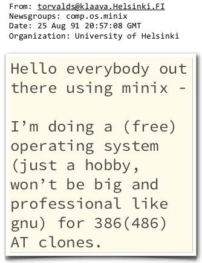
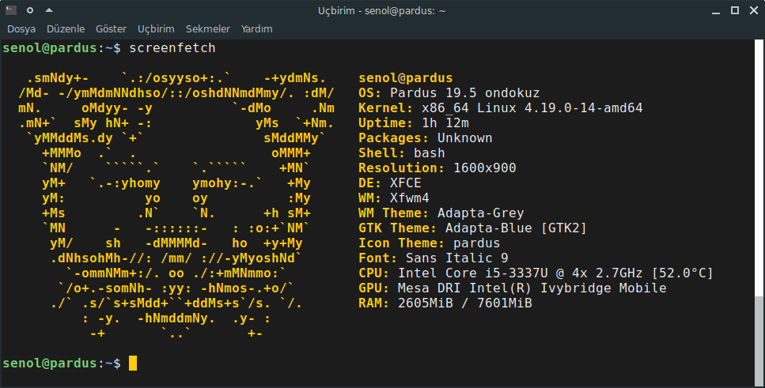
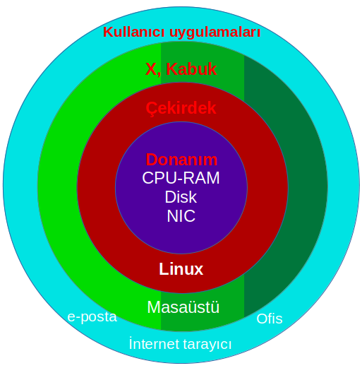

# Çekirdek -Kernel-  ve Kabuk -Shell-

İşletim sisteminin merkezinde yer alan ve  sistemde tam kontrole sahip olan yazılıma işletim sistemi çekirdeği diyebiliriz.  Çekirdek -kernel- işletim sistemi kodunun her zaman bellekte bulunan bölümü olup sistemimizin bellek, CPU gibi üniteleri ve yazılımların çalışmasını yönetir.

 

 
Yukarıda bahsettiğimiz GNU, çekirdek olarak yaygın bir şekilde Linux çekirdeğini kullanır. Dolayısıyla Linux çekirdeği üzerindeki GNU araçlarıyla -yazılımlarıyla- bir işletim sistemini oluşturur ve bu sebeple adlandırırken GNU/Linux şeklinde belirtmemiz çok daha doğru olacaktır.

 

Linus Torvalds henüz bir öğrenci iken hobi olarak başladığı ve 1991 yılında comp.os.minix haber grubunda paylaştığı proje ile bugün bir çok dağıtımda ve  kullandığımız birçok cihazda bulunan GNU/Linux çekirdeği ile özgür yazılım alanındaki büyük açığı ‑eksikliği‑ kapatmıştır. Elbette ki o dönemde GNU projesi kapsamında çekirdek yazılımı üzerine çalışmalar yapılmaktadır -GNU Hurd-. Ancak adını yazarından -Linus- alan Linux, henüz tamamlanmamış bu projenin önüne geçmiştir diyebiliriz.

Çekirdek ve çekirdek türleri detayına  bu belgelendirmede değinmeyeceğiz ancak sizler İnternet ’ten detaylı bilgilere erişebilirsiniz. 
Kabuk -shell- için ise kullanıcıdan aldığı girdileri işletim sistemine ileten programdır diyebiliriz.  Kabukları komut satırı arabirimi (CLI) ya da grafik kullanıcı arabirimi (GUI) olarak ayırabiliriz. 
Bu eğitimde “bash" kabuğu üzerinde uygulamalar gerçekleştireceğiz.

“Bash", “GNU/Linux" sitemlerde yaygın olarak kullanılan uçbirim/terminal. UNIX sistemlerde kullanılan Steve Bourne tarafından yazılan “sh" komut yorumlayıcısının ‑terminal- yerine yazılmıştır ve bu yüzden “sh" ın yazarına atfen BASH -Bourne Again SHell-  olarak adlandırılmıştır.

**Yaygın kullanılan Unix ve GNU/Linux komut yorumlayıcıları:**

 

- **Sh**, - Bourne shell

- **Bash**, - Bourne Again shell

- **Ksh**, - Korn shell

- **Tcsh / Csh** 

- **Zsh**

- **Fish**

 
 
 

 

>>Araştırma konuları: UNIX, BSD 
 