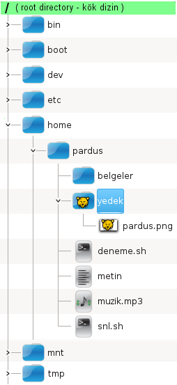

## **Bash Kullanımı**

### **Komut Yapısı -Syntax-**

</br>

Bir komutun;
* işlevine,
* dizilimine,
* parametrelerinin işlevlerine,
* yazarına,
* lisansına, </br>
**man** -manual- komutu ile bakabiliriz.

``` {.sh}
man echo
```

Biz aşağıda genel anlamda bir komutun diziliminin nasıl olduğuna bakacağız.

Bir komutun genel olarak kullanım biçimi, 

``` {echo}
<command>  [--OPTION]  [PATH]  [PATH]
```

şeklindedir. 

Köşeli parantezler ( [ , ] ) komutun kullanımında zorunlu olmayan kısımları ifade etmek için kullanılmıştır. Buradan parametrelerin ve adreslerin (path=yol) her zaman ya da her komutta kullanılma zorunluluğunun olmadığı sonucunu çıkartabiliriz. Örneğin “clear” komutu uçbirim ekranını temizler ve dosya sistemi üzerinde işlem yapmadığından kullanımında herhangi yol tanımı yapılmaz.
</br>

#### Parmetre / Opsiyon / Anahtar

Seçenekler -**option**- ise komutların ana işlevlerinin ekstra özellikleriyle kullanılmasını sağlar.  Örneğin detaylı dosya listesini görüntülemek istiyorsanız dosya listeleme komutu olan “**ls**” komutunu “**-l**” opsiyonu ile “**ls -l**” şeklinde kullanmanız gerekir. Bu opsiyonlar -option-, parametre ya da anahtar adıyla da belirtilebilirler. Ancak parametre deha geniş bir tanımdır ve komuta gönderilen değerleri de kapsayabilir.

>**Opsiyonlar** ise genellikle, tek karakter kısaca ya da açık hali ile kullanılabilirler. Tek karakter ile gösterimlerde “**-**” işareti ile kullanılırken açık hali ile kullanırken “**--**” karakterleri ile yazılır. Çoğu durumlarda opsiyonu kullandığımız noktada bir yol tanımı -dosya/dizin adı- beklenmiyorsa "**-**" ya da "**--**" işaretleri kullanılmayabilir. 

Bu kısmı örneklemek gerekirse "**.**" ile başlalay dosyaları listelemek için aşağıdaki her iki yazım şekli de kullanılabilir.

``` {.sh}
ls -a
```

``` {.sh}
ls --all
```

>Opsiyonları kullanırken tek "**-**" işaretine birden fazla seçenek girebileceğimiz gibi ayrı ayrı da belirtebiliriz.

Aşağıdaki yazım şekilleri aynıdır.


Tüm dosyaları -**a:all**- detaylı biçimde -**l:long**- boyuta -**S:size**- göre ters -**r:reverse**- sırada listele.


``` {.sh}
ls -a -l -S -r
```

``` {.sh}
ls -alSr
```

``` {.sh}
ls -alS --reverse
```
</br>

#### **PATH/Yol Tanımı**

Yol tanımından kasıt, yazdığımız komutun hangi dosyalar/dizinler üzerinde geçerli olmasını istiyorsak bu dosya ve dizinlerin konumunu belirtmektir.  

**"[,]"** içerisinde yazılmazından da anlaşşılacağı gibi her komutta ya da her bir yol tanımı zorunluluğu yoktur. Örneğin **clear** komutu terminal ekranını temizler ve bir yol -**path**- tanımından bahsedemeyiz. 

Komutların geçerli olacağı konuma -file/directory- kaynak path -**source path**-, kısaca kaynak -**source**- diyebiliriz. Ancak, kopyalama -**cp**-, taşıma -**mv**- gibi işlemlerde bir de hedef belirtmek gereklidir. Bu hedef konuma da **destination** ya da **target directory** diyebiliriz.

>Kaynak ya da hedef adresi belirtirken güncel hayattaki gibi 2 farklı yöntem kullanabiliriz. Nasıl ki yer yüzünde bir noktanın adresi 2 farklı şekilde ifade edilebiliyor ise sistemimizdeki bir konum da 2 farklı şekilde gösterilebilir. 

<br>

#### **Mutlak Yol -Absolute Path-**
</br>

Mutlak yol için mektup adresi benzetmesini yapabiliriz. Doğru belirtilmiş bir **tam** adres **çalışma dizininiz önemli olmaksızın** aynı noktayı gösterir. 

>**POSIX**-Portable Operating System Interface- ile uyumlu işletim sistemlerinde belirtilen adres kökten -**root -/-** başlar ve sadece bir konumu işaret eder. 

 Örneğin, "**/home/senol/pardus.txt**" mutlak bir yoldur ve "pardus.txt" dosyasının **/home/senol** dizininde -senol kullanıcısının ev dizininde- bulunduğunu gösterir.

Yol belirtirken ayraç olarak web adreslerindeki gibi "**/**" karekteri kullanılır. https://www.pardus.org.tr/belgeler/ 

Windows için de mutlak ve göreceli adres tanımları aynı olmak ile birlikte yolu ayraç olarak yaygın kullanımda "**\***" karakteri kullanılıyor olsa da PowerShell'de de "**/**" karakteri kullanılabilir ancak kök dizin her bir sürücü etiketinden başlatılır. "**C:\users**" ya da "**D:/users**" gibi.

<br>

#### **Göreceli Yol -Relative Path-**

</br>

Göreceli yol, kullanıcının bulunduğu dizin -çalışma dizini- ile üzerinde işlem yapacağı dosya veya dizinin konumunun ilişkilendirilmesiyle oluşan yoldur. Nasıl ki adres soran birisine "100 metre ileride sağda" gibi bir tarif yapabiliyorsak bir dosya dizin konumunu tam adres -mutlak adres- yerine "iki dizin yukarısı" gibi bir yol belirtebiliriz.

 

Örneğin, pardus.txt dosyası için "**/home/senol/pardus.txt**" şeklindeki mutlak bir adres gösterimi çalışma dizinin -o anda bulunulan konum- zaten kendi ev dizini olan senol kullanıcısı için göreceli olarak "**./pardus.txt**" şeklinde belirtilebilir.

</br>
<div style="color:red;"> 

>Göreceli yol -path- tanımında "**.**" -tek nokta- çalışma dizinini --**pwd**-- gösterirken, "**..**" bir üst dizini gösterir. Yani pat tanımının bulunduğumuz konumu ifade etmek için "**.**", bir üst dizini ifade etmek için "**..**", 2 üst dizini ifade etmek için "**../..**" şeklinde yazmalıyız.  

</br>

>"**~**" karakteri aktik kullanıcının ev dizinini göstermek için kullanılır. "**~senol**" şeklinde bir kullanım ise senol kullanıcısının ev dizini -**/home/senol**- anlamına gelir.  

</div>
</br>

>Özetle göreceli yollar, kullanıcının bulunduğu dizin değiştiğinde değişebilirken, mutlak yollar her zaman aynı dosya veya dizinin konumunu gösterir. Terminalde çalışırken yol tanımında hangi yöntemi kullandığınız önemli olmasa da projelerinizi oluştururken kullanacağınız yöntemi dikkatli seçmelisiniz. Projenizin konumunun değişebileceğiniz, yazdığınız betiğin kullanıcısının farklı olabileceğini unutmamalısınız.

<br>


Konuyu bir örnekle detaylandırabiliriz... 




Yandaki görselde “**home**” dizini -klasörü- kullanıcı ev dizinlerinin bulunduğu  dizindir. Yandaki şekilde  “**pardus**” kullanıcısı  ve bu kullanıcıya ait klasör ve dosyalar listelenmiştir. 
</br>

Bu görsele göre şu tarifleri yapabiliriz;
* **pardus.png** dosyasının tam yolu -mutlak adresi- :</br>
 **/home/pardus/yedek/pardus.png** 

 </br>

* **deneme.sh** dosyasının tam yolu -mutlak adresi- :</br>
 **/home/pardus/deneme.sh** 
</br>
</br>

Göreceli yol örnekleri için görselde işaretlenmiş yedek dizininin aktif dizin olduğunu dikkate alarak diğer dosyalar için aşağıdaki yol tanımlarını inceleyebiliriz...

**pardus.png** dosyası üzerinde işlem yapmak için aşağıdaki her üç kullanımda doğrudur. 

1. ) 

```{echo}
<komut>  /home/pardus/yedek/pardus.png
```

2. )

 ```{echo}
<komut>  ~/yedek/pardus.png
```

3. )

 ```{echo}
<komut>  pardus.png
```

<br>


Bulunduğumuz klasörde olmayan bir dosya/dosya grubu  üzerinde bir komutu uygulamak için ise yine bulunduğumuz klasöre göre yol tanımı yapabilir -**göreceli**- ya da tam yolu -**mutlak**- belirtmemiz gerekir.

Örneğin "metin" dosyasi için:

</br>

1. )

```{echo}
 <komut>  /home/pardus/metin
```

2. ) 

```{echo}
<komut>  ../metin
```

1. )

```{echo}
 <komut>  ~/metin
```


Her üç kullanımda da ilgili komut “metin” dosyası üzerinde işlem yapacaktır.  
1. kullanım metin dosyasının mutlak referansı olduğundan herhangi bir konumdan kullanılabilir. 
2. gösterimdeki komut kullanımında ise bir üst dizindeki metin dosyası ifade edildiğinden bu kullanım sadece “pardus” klasöründeki herhangi bir dizin içerisinde iken kullanılabilir. 
3. kullanımdaki **~** -tilda- karakteri aktif kullanıcnın ev dizinini gösterdiğinden **pardus** kullanıcısı tarafından  herhangi bir konumdan kullanılabilir.

Aşağıdaki gibi bir kullanımda ise komutun işlevi bulunduğunuz klasör önemli olmaksızın her zaman kök (root) dizindeki “tmp” klasörü üzerinde  gerçekleşir.
	
<komut> /tmp


<div style="color:red;"> 

Tam dizin hirerarşisi için "**Linux Dosya Sistemi" konusunundaki görseli inceleyebilirsiniz. 

</div>

</br>

>Komutların kullanımında birden fazla dosyayı ifade etmek için dosya isimlerindeki benzerlikler dikkate alınarak joker karakterler **\*, ?** ** ve **.** ile patern -desen- uygulanabilir. 


</br>

 [Bash kabuğu değişkenleri](./tr_bash-kabugu-degiskenleri.md) << Önceki / Sonraki >> [Dosya adları ve patern uygulama](./tr_dosya-adlari.md)

