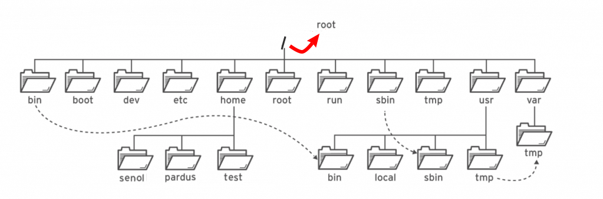

# Hiyerarşi

Günümüzde yüzlerce linux dağıtımı bulunmaktadır. Her bir dağıtım kendi dizin yapısı hiyerarşisi kullanmaya başladığında her bir linux dağıtımına özel dizin yapısını bilmek gerekiyordu. Bu sorunu aşmak için Dosya sistemi hiyerarşi standartı (Filesystem Hierarchy Standard(FHS belirlendi. Bu standartın amacı kurulan yazılımların ve kullanıcıların kullanacağı dosya ve dizinleri belirlemektir. Bu standartlara göre man dosyalarının, programların yeri, veri tutan dizinlerin yeri vs hepsi belli bir kurala göre düzenlenmiştir. http://www.pathname.com/fhs adresinden en güncel standartı inceleyebilirsiniz. 

Linux sistemlerde dizin hiyerarşişi genel olarak aşağıdaki şekildeki gibidir.

<br>

<br>
<br>

|||
|:-|:-|
|/bin|Temel Komutlar|
|/boot|Ön yükleyicinin kullandığı dosyalar|
|/dev|Aygıt dosyaları|
|/etc|Sistem yapılandırma dosyaları|
|/home|Kullanıcıların ev dizinleri|
|/lib|Paylaşılan temel kütüphaneler ve çekirdek modülleri|
|/media|Çıkarılabilir aygıtlar için bağlama noktası|
|/mnt|Dosya sistemlerini geçici olarak bağlama noktası|
|/opt|Sonradan eklenen uygulamalar|
|/proc|Sistemin genel ve anlık bilgilerini içeren sanal dosya sistemi|
|/sbin|Temel sistem yöneticisi komutları|
|/tmp|Geçici dosyalar|
|/usr|İkincil kök, kullanıcı için yeni dizilim noktası|
|/var|Değişken veriler, log dosyaları vb.|
|||

## /bin
**/bin** dizini sistem yöneticileri ve normal sistem kullanıcıları için kullanışlı temel komutları barındırır. Kullanıcı kabuğu bash ve ls, cp, rm, cat gibi pek çok temel komutu içermesi nedeni ile en basit sistem kurulumunda bile oluşturulur.

## /boot
İşletim sisteminin açılması için gerekli bütün dosyalar bu dizindedir. Çekirdekler ve initrd kalıpları bu dizinde yer alır.

``` {.sh}
ls /boot/
```

Komut çıktısı:
``` {.echo}
config-4.19.0-13-amd64      initrd.img-4.19.0-16-amd64.old-dkms
config-4.19.0-16-amd64      System.map-4.19.0-13-amd64
grub                        System.map-4.19.0-16-amd64
initrd.img-4.19.0-13-amd64  vmlinuz-4.19.0-13-amd64
initrd.img-4.19.0-16-amd64  vmlinuz-4.19.0-16-amd64
```

## /dev
Bu dizin özel veya aygıt dosyalarının konumudur. UNIX dünyasındaki “herşey bir dosyadır” kuralının bir göstergesi olarak bilgisayara bağlı aygıtlar, donanımlar /dev altında kendilerine erişimi sağlayan bir dosyaya sahiptirler.

## /etc
Sistemin önemli yapılandırma dosyaları bu dizindedir. Yapılandırma dosyaları çalıştırılamayan fakat okunan ve yorumlanan dosyalardır. Bir programın nasıl çalışacağınıbelirlerler. Buradaki dosyalar olmadan sistem programları düzgün çalışmayacaktır. O nedenle /etc için sistemin kalbidir diyebiliriz. Her zaman yedeklemede önceliğe sahiptir.

## /home
Linux çok kullanıcılı bir işletim sistemi olarak kullanıcıların dosyalarını başkalarına karşı koruduğu gibi herkese çalışması için bir ev (home) dizini sunar. Linux’ta standart olarak kullanıcı dizinleri **/home** altında yer alır. Buraya kullanıcı istediği dosyaları yerleştirir, programları kurar veya siler. Çok fazla kullanıcı olan sistemlerde bu dizinin ayrı bir disk bölümü olması tavsiye edilmektedir. Bir kullanıcı açılırken kullanıcı dizinine bazı dosyalar otomatik olarak kopyalanır. Bu
dosyalar **/etc/skel** altındaki dosyalardır.

## /lib
Bu dizin çekirdek modülleri ve sistem kütüphanelerini içerir. Çekirdek modülleri sistemin açılışı için gerekli olup bazı donanımların sistem tarafından tanınmasını sağlar. Sistem kütüphaneleri ise **/bin** ve **/sbin** altındaki programların çalışması için gerekli C kütüphaneleridir.
Kütüphane dosyalarının uzantısı *.so şeklindedir.
Çekirdek modülleri ve aygıt sürücüleri /lib/modules/’kernel-version’ dizini altındadır. Linux altında birden fazla çekirdek olabileceği için bu şekilde çekirdek sürümü ile dizinler ayrılmaktadır. Açılış zamanında hangi çekirdek seçilirse onun dizinindeki modüller yüklenir.

## /lost+found
Bazı zamanlar bilgisayar doğru kapanmamış olabilir, elektrik kesintisi nedeni ile aniden kapanmış olabilir. Bu durumda bir sonraki açılışta işletim sistemi dosya sistemi kontrolü (fsck programı ile) yapacaktır. Bu kontrol sonucunda bozulmuş veya kaybolmuş bir şey varsa düzeltip veya bulup bu dizin altına koymaktadır. Her disk bölümü kendi lost+found dizinine sahiptir. lost+found dizinindeki dosyalar eğer düzgün ise olmaları gereken dizine geri taşınırlar.

## /media
Disket, cd-rom, dv-rom, cd/dvd-rw gibi sökülüp takılabilir dosya sistemleri bu dizine bağlanmaktadır.

## /mnt
Dosya sistemlerini veya aygıtları bağlamak için kullanılan genel bağlama noktasıdır.

Bağlama işlemi mount komutuyla yapılır:

**mount /dev/hdd /mnt**

## /opt
İşletim sisteminin öntanımlı kurulumu ile gelmeyen tüm yazılım ve paketlerin kurulumu için /opt dizini tahsis edilmiştir. Örneğin, Kylix, StarOffice, WordPErfect vb...
Bu dizin Windows altındaki “Program Files” dizinine benzetilebilir. Her üretici bu dizin altında kendi adıyla veya programın adıyla bir dizin açar ve programlarını bu dizinin içerisine kurar. /opt/surgate, /opt/endersys veya /opt/ecm gibi.

## /proc
**/proc** sanal bir dosya sistemidir. Linux’un sunduğu en güçlü özelliklerden biri de **/proc** dosya sistemidir. Buradaki dosyalar gerçek içerik taşımaz. Çalışma zamanında çekirdek tarafından içerikler güncellenebilir. Sistem belleği, bağlanmış aygıtlar, donanım bilgisi, süreçlerin durumu gibi çekirdeğe ait bilgileri barındırır. Pek çok sistem
programı bilgilerini bu dizinden alırlar:

Yukarıda görüleceği gibi lsmod komutu **/proc/modules** dosyasındaki bilgileri yorumlar. Bunun gibi ‘lspci’ komutu da **/proc/pci** dosyasını okur.

## /root
Sistem yöneticisinin ev dizinidir. Sistem kullanıcısı **root** isimli hesaba sahiptir ve bu hesabın ev dizini **/root** dizinidir. **/home** dizini genelde farklı disklerde olduğundan herhangi bir nedenle yetkili kullanıcının sisteme erişememe problemi yaşamaması için ev dizini köke alınmıştır.

## /sbin
Sistem programları (system binary) bu dizinde bulunur. Sistem programlarının normal programlardan (/bin) farkı sistem yönetimine yönelik olmalarıdır. Büyük bir kısmını çalıştırmaya normal kullanıcılar yetkili değildir. Çalıştırabildikleri ise sistemden bilgi almaya yönelik, sistemde değişiklik yapmayan sistem komutlarıdır.

>mkfs disk biçimlendirme komutu, lspci, lsmod, service, sysctl, syslogd, grub, fsck, dump, init, modprobe gibi sistem komutları bu dizindedir.

## /usr
Sistemde en çok yer kaplayan dizin /usr dizinidir. Bu dizin kullanıcı için ikinci bir kök dizin olarak düşünülebilir. Nasıl ki sistemin /bin, /sbin dizinleri var; /usr/bin ve /usr/sbin dizinleri de vardır. Sisteme sonradan kullanıcı tarafından kurulan programlar /usr ‘ı kök kabul ederek dosya sistemine yerleşirler. Örneğin kullanıcı programları /usr/bin’e, sistem programları /usr/sbin’e, yapılandırma dosyaları /usr/etc veya /usr/local/etc’ye yerleştirilir.

``` {.sh}
ls /usr/
```
komut çıktısı aşağıdadır:

``` {.echo}
kaan@pardus:~$ ls /usr/
bin    include  lib32  libexec  local  share  Xerox
games  lib      lib64  libx32   sbin   src
```
## /var
Genel olarak değişken (variable) veriler/dosyalar bu dizinde tutulur. Örneğin sistem günlükleri, mail kuyruğu, gelen mailler, yazıcı kuyruğu, programların kilit dosyaları
vs...

``` {.sh}
ls /var/
```
komut çıktısı aşağıdadır:

``` {.echo}
kaan@pardus:~$ ls /var/
agentx   cache  lib    lock  mail  run   spool  www
backups  kodak  local  log   opt   snap  tmp
```

**/var** ve **/usr**’ın ayrı bölümlerde olması sistem yönetimini kolaylaştırır. Çünkü /usr yalnız okunur şekilde bağlanıp korumaya alınabilir. Çünkü /usr altına dosya eklemek veya ordaki dosyaları değiştirmek çok nadiren gerçekleşir. /var ise her saniye değişebilir. Sürekli gelen emailler, sürekli günlük yazan programlar düşünülürse ne kadar yoğun yazmaya tabi tutulduğu daha kolay anlaşılır.

## /tmp
Geçici olarak kullanılacak dosyalar bu dizinde oluşturulur. Bütün programlar ve kullanıcılar bu dizine yazabilirler. Buradaki dosyaları ne yaptığınıza emin olmadan silmeniz tehlikeli olabilir. Çünkü silinen dosyaları o an çalışan süreçlerden biri kullanıyor olabilir.